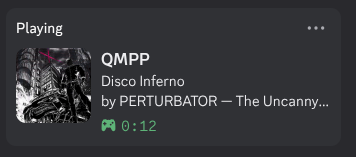

<div align="center">
  
  <h1>QMMP Discord Rich Presence</h1>
  <p>A <a href="https://qmmp.ylsoftware.com/">QMMP</a> General plugin that shows your currently playing music as Discord Rich Presence on Linux.</p>
  
</div>

## Features

- Shows track title, artist, album, and elapsed time while playing
- Shows "Paused" state when paused; clears presence when stopped
- Fetches album art automatically (no configuration required)
- Falls back to the QMMP logo when no art is found
- Reconnects automatically if Discord restarts
- Works out of the box — no Discord Application ID setup needed

## Compatibility

| QMMP install | Discord / Vesktop install | Works? |
|---|---|---|
| System | Native / AppImage / AUR | ✅ |
| System | Snap | ✅ |
| System | Flatpak | ✅ |
| Flatpak | Native / AppImage / AUR | ✅ (build.sh sets permissions) |
| Flatpak | Snap | ✅ (build.sh sets permissions) |
| Flatpak | Flatpak | ✅ (build.sh sets permissions) |

Tested on Fedora with Flatpak QMMP and Flatpak Vesktop.

## Installation

### Pre-built binary

Download `libdiscordrichpresence.so` from the [latest release](https://github.com/foofly/qmpp-discord/releases/latest) and copy it to your QMMP plugin directory:

| QMMP install | Plugin directory |
|---|---|
| System | `/usr/lib64/qmmp/General/` or `/usr/lib/qmmp/General/` |
| Flatpak | `/var/lib/flatpak/app/com.ylsoftware.qmmp.Qmmp/x86_64/stable/active/files/lib/qmmp-2.3/General/` |

If using Flatpak QMMP, also run:
```bash
    flatpak override --user --filesystem=xdg-run/discord-ipc-$i com.ylsoftware.qmmp.Qmmp
```

### Build from source

**1. Install build dependencies**

| Distro | Command |
|---|---|
| Fedora / RHEL | `sudo dnf install cmake gcc-c++ qt6-qtbase-devel qt6-qtwebsockets-devel qmmp-devel` |
| Arch Linux | `sudo pacman -S cmake qt6-base qt6-websockets qmmp` |
| Debian / Ubuntu | `sudo apt install cmake g++ qt6-base-dev libqt6websockets6-dev qmmp-dev` |
| openSUSE | `sudo zypper install cmake gcc-c++ qt6-base-devel qt6-websockets-devel qmmp-devel` |
| NixOS | `nix-shell -p cmake qmmp qt6.qtbase qt6.qtwebsockets gcc` |

> `qt6-qtwebsockets` is recommended but optional. Without it the plugin falls back to Unix socket only (no WebSocket fallback for arRPC).

**2. If QMMP is installed as a Flatpak**, download the matching `qmmp-devel-*.x86_64.rpm` (Fedora/RHEL) or `qmmp-dev_*.deb` (Debian/Ubuntu) into this directory. The build script will extract the headers automatically. On Arch and openSUSE, the system `qmmp` package already provides the headers — no extra file needed.

**3. Build and install**

```bash
./build.sh
```

The script detects whether QMMP is a Flatpak or system install, builds the plugin, installs it to the correct plugin directory, and sets the required Flatpak sandbox permissions if needed.

### Enable in QMMP

1. Open QMMP → **Settings → Plugins → General**
2. Enable **Discord Rich Presence**
3. Make sure Rich Presence is enabled in your Discord client:
   - Discord: **User Settings → Activity Privacy → Share your activity**
   - Vesktop: **Settings → Vesktop Settings → Enable Rich Presence**

## Configuration

The plugin works with no configuration. If you want Rich Presence to appear under a different application name (e.g. your own Discord Application), open the plugin settings and enter your Application ID there. Leave it blank to use the built-in one.

To create your own Discord Application: [discord.com/developers/applications](https://discord.com/developers/applications)

## Troubleshooting

**Rich Presence not showing**
- Confirm Rich Presence / activity sharing is enabled in your Discord client settings.
- Run QMMP from a terminal and look for `DiscordRichPresence:` log lines to see what the plugin is doing.

**Cover art not showing**
- Cover art is fetched from the iTunes Search API using the track's artist and album tags. Tracks without tags, or tracks not in the iTunes catalogue, will show the QMMP logo instead.

**Flatpak QMMP can't connect**
- Re-run `build.sh` — it sets the required `flatpak override` permissions automatically.
- Or set them manually:
  ```bash
  for i in $(seq 0 9); do
      flatpak override --user --filesystem=xdg-run/discord-ipc-$i com.ylsoftware.qmmp.Qmmp
  done
  ```

## Credits

- **[foofly](https://github.com/foofly)** — author and maintainer.
- **[QMMP](https://qmmp.ylsoftware.com/)** — Qt-based multimedia player this plugin is written for.
- **[arRPC](https://github.com/OpenAsar/arrpc)** by [OpenAsar](https://github.com/OpenAsar) (MIT) — open reimplementation of the Discord RPC server bundled in [Vesktop](https://github.com/Vencord/Vesktop). This plugin's WebSocket fallback speaks the arRPC protocol, enabling Rich Presence inside Flatpak sandboxes without filesystem overrides.
- **[iTunes Search API](https://developer.apple.com/library/archive/documentation/AudioVideo/Conceptual/iTuneSearchAPI/)** by Apple — used to fetch album artwork. No API key required.
- **Discord** — Rich Presence IPC protocol. Discord is a trademark of Discord Inc.

## License

GPL v2 or later — see [QMMP's licence](https://qmmp.ylsoftware.com/) for context (this plugin links against libqmmp/libqmmpui).
